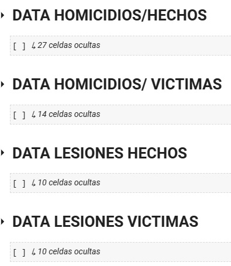
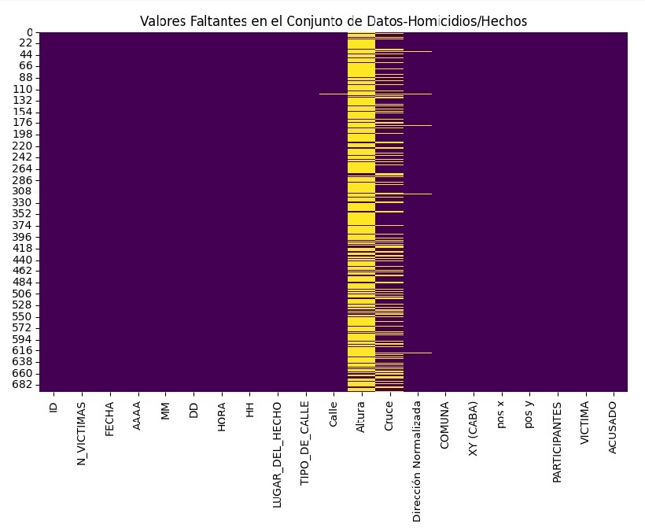
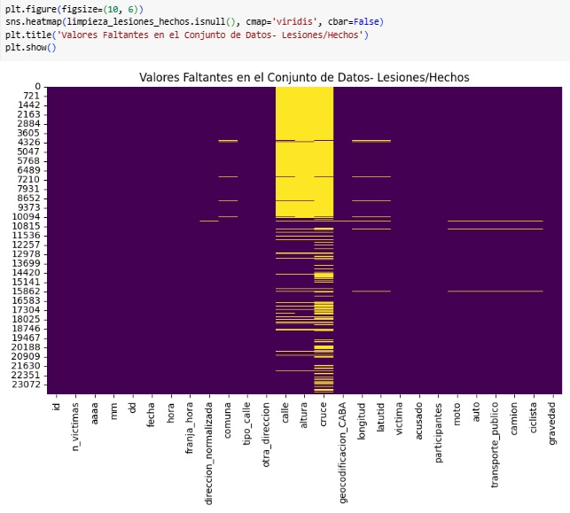
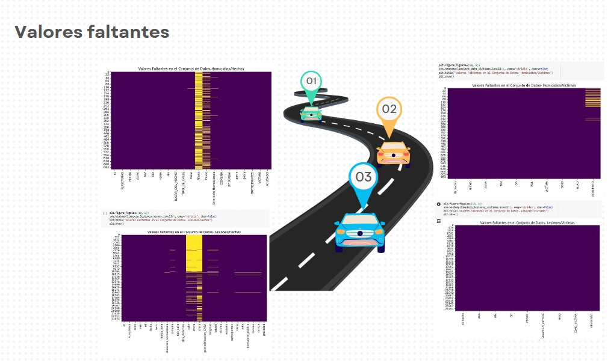
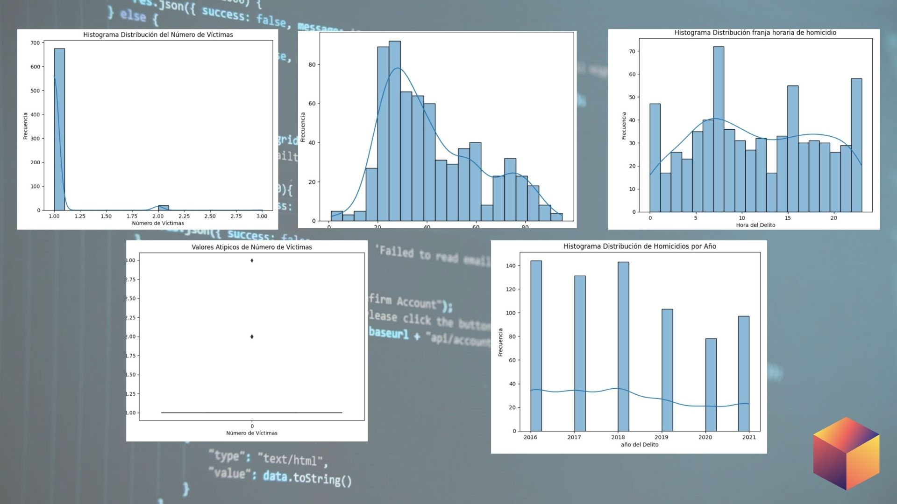
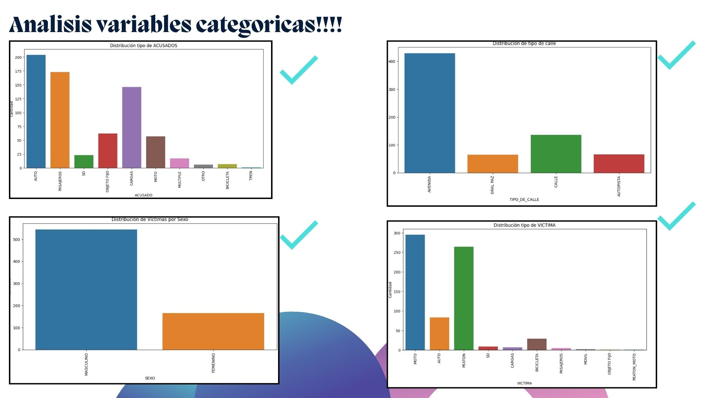
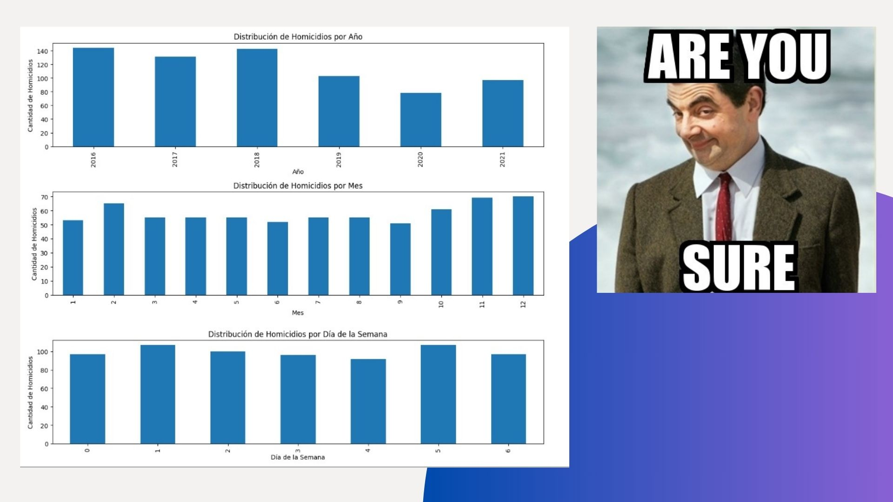

<h1 align='center'>
 <b>PROYECTO INDIVIDUAL Nº2 - Antonio Claudio Ortiz</b>
</h1>
 
# <h1 align="center">**`Siniestros viales`**</h1>

## **Empecemos a platear la solucion con los excel proporcionados:**

**1- data_homicidios.xlsx**

**2- lesiones.xlsx**

### En primera instancia el proyecto se realizo en :

## DESCRIPCION DEL JUPYTER

Como se observa en la imagen, data_homicidios.xlsx se clasifica en dos secciones:

- DATA HOMICIDIO / HECHOS

- DATA HOMICIDIO / VICTIMAS

Se ejecuta comandos basicos para conocer el Dataset:

        limpieza_data_homicidios.head(2)

        limpieza_data_homicidios.shape

        limpieza_data_homicidios.columns

        limpieza_data_homicidios.info()

para conocer mas en detalle el DataSet, por ser extenso en columnas se decide: 

***# Vamos a dividir en primera instancia en tres dataframe***

---

**df_Id_victimas**

**df_id_lugar**

**df_id_acusado**

---
**Vamos a Guardar en formato CSV los dataframe**

                                                **df_id_acusado**

df_id_acusado.to_csv('/content/drive/MyDrive/registro_acusados.csv', index=False)

                                                **df_id_lugar**

df_id_lugar.to_csv('/content/drive/MyDrive/registro_lugar.csv', index=False)

                                                **df_id_victimas**

df_id_victimas.to_csv('/content/drive/MyDrive/registro_victimas.csv', index=False)

### Ademas con DATA HOMICIDIO / VICTIMAS se realizo

limpieza_data_victimas.columns

limpieza_data_victimas['FECHA_FALLECIMIENTO'] = pd.to_datetime(limpieza_data_victimas['FECHA_FALLECIMIENTO'],errors='coerce')

### VERIFICACION DE : 

limpieza_data_victimas.isnull().sum()

limpieza_data_victimas.duplicated().sum()

## ***Unas de las primeras conclusiones es que el Dataset Homicidios no tiene datos raros solo en columas especificas***

## ***Con respecto a DATA LESIONES HECHOS PREVALECEN LOS sd, SD como se observa en la imagen ***

## El Trabajo trabajo tambien tiene una seccion EDA(Analisis exploratorio de datos) 

## > Empezamos el camino de Analizar las variables - Numericas de los DataSets

 ## > Empezamos el camino de Analizar las variables - Categoricas de los DataSets  
                                                                                                             
## > Veamos la distribucion de los Homicidios en forma simultanea - Años/Meses/Semanas

# > LLegamos a la parte de los KPIS

  

##  **Debes graficar y medir los 2 KPIs propuestos a continuación, representándolos adecuadamente en el dashboard. A su vez, tambíen tienes que proponer, medir y graficar un tercer KPI que consideres relevante para la temática.**

**1.   Reducir en un 10% la tasa de homicidios en siniestros viales de los últimos seis meses, en CABA, en comparación con la tasa de homicidios en siniestros viales del semestre anterior.**

- Decidir que tabla y columnas seran necesaria para generar el indicador
- Agrupar por Años, Meses en relacion Numeros de victimas
 
homicidios_por_mes_y_anio = df_id_victimas.groupby(['Año', 'Mes'])['Nro_victimas'].count().reset_index()

- Renombrar columna

homicidios_por_mes_y_anio = homicidios_por_mes_y_anio.rename(columns={'Nro_victimas': 'Cantidad de Homicidios'})

- Tomar la decision de como dividir los semestres, en una forma standar(Enero-Junio)(Julio-Diciembre)

                df_2016 = homicidios_por_mes_y_anio[homicidios_por_mes_y_anio['Año'] == 2021]

                primer_semestre = df_2016[df_2016['Mes'].between(1, 6)]['Cantidad de Homicidios'].sum()

                segundo_semestre = df_2016[df_2016['Mes'].between(7, 12)]['Cantidad de Homicidios'].sum()

                print(f"Primer semestre (meses 1 al 6): {primer_semestre}")
                print(f"Segundo semestre (meses 7 al 12): {segundo_semestre}")

- Calculo de la tasa de homicidios

                tasa_homicidios_actual = ((segundo_semestre/3120612) * 100000)
                tasa_homicidios_anterior =  ((primer_semestre/3120612)*100000)

- Reduccion en porcentajes

        reduccion_porcentaje = ((tasa_homicidios_anterior - tasa_homicidios_actual) / tasa_homicidios_anterior) * 100

**2.   Reducir en un 7% la cantidad de accidentes mortales de motociclistas en el último año, en CABA, respecto al año anterior.**

- Decidir que tabla, columnas seran necesaria, ademas de filtros para generar el indicador 

                filtro = limpieza_data_victimas[limpieza_data_victimas['FECHA_FALLECIMIENTO'] != 'NaT']

                filtro = limpieza_data_victimas[limpieza_data_victimas['VICTIMA'] != 'SD']

                filtro = limpieza_data_victimas[limpieza_data_victimas['VICTIMA'] == 'MOTO']

- Agrupar por Años, Vicitmas en relacion cantidad de Fallecimientos
- Renombrar columna
- Definir tema fecha actual y fecha anterior

                año_actual = 2021
                df_año_actual = fallecimineto_victima_y_anio[fallecimineto_victima_y_anio['AÑO'] == año_actual]

                                # DataFrame para el año anterior (por ejemplo, 2021)
                año_anterior = año_actual - 1
                df_año_anterior = fallecimineto_victima_y_anio[fallecimineto_victima_y_anio['AÑO'] == año_anterior]

                                # cantidad de fallecidos en el año actual
                fallecidos_año_actual = df_año_actual['Cantidad de fallecidos'].sum()

                                #cantidad de fallecidos en el año anterior
                fallecidos_año_anterior = df_año_anterior['Cantidad de fallecidos'].sum()

                print(f"Año anterior ({año_anterior}): {fallecidos_año_anterior} fallecidos")
                print(f"Año actual ({año_actual}): {fallecidos_año_actual} fallecidos")
- Calculo cantidad de accidentes

                # cantidad de accidentes mortales de motociclistas en el último año y en el año anterior

                fallecidos_año_actual = df_año_actual['Cantidad de fallecidos'].sum()

                fallecidos_año_anterior = df_año_anterior['Cantidad de fallecidos'].sum()

- Reduccion en porcentajes

                reduccion_porcentaje = ((fallecidos_año_anterior - fallecidos_año_actual) / fallecidos_año_anterior) * 100

**3.  **Este KPI se centrará en analizar la tasa de accidentes según el tipo de vehículo involucrado (por ejemplo, moto, auto, transporte público, camión, ciclista) en un período de tiempo específico. La idea es calcular la tasa de accidentes para cada tipo de vehículo y compararla con un período anterior para evaluar si ha habido mejoras en la seguridad vial.**.**

## Veamos los Graficos

  

  <iframe loading="lazy" style="position: absolute; width: 100%; height: 100%; top: 0; left: 0; border: none; padding: 0;margin: 0;"
    src="https:&#x2F;&#x2F;www.canva.com&#x2F;design&#x2F;DAFwfJL42DQ&#x2F;view?embed" allowfullscreen="allowfullscreen" allow="fullscreen">
  </iframe>

<a href="https:&#x2F;&#x2F;www.canva.com&#x2F;design&#x2F;DAFwfJL42DQ&#x2F;view?utm_content=DAFwfJL42DQ&amp;utm_campaign=designshare&amp;utm_medium=embeds&amp;utm_source=link" target="_blank" rel="noopener">Analisis variables categoricas!!!!</a> de antonio claudio Ortiz